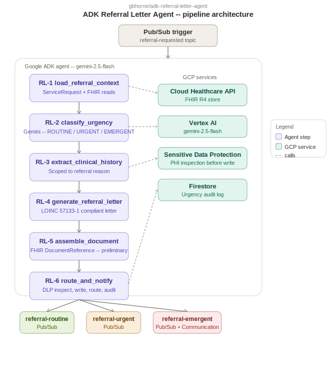

# ADK Referral Letter Agent

LOINC 57133-1 compliant specialist referral letters with urgency classification (ROUTINE / URGENT / EMERGENT) -- Google ADK + Gemini 2.5 Flash on GCP.

Project 4 of 9 in the [Healthcare Agentic AI portfolio](https://github.com/gbhorne).

---

## Disclaimer

This project uses entirely synthetic, fictitious FHIR data generated for demonstration purposes only. No real patient data, protected health information, or actual clinical records are used at any stage. All patient names, clinical values, diagnoses, and medications are fabricated. This project is not intended for clinical use.

---

## Generated Referral Letter -- Sample Output

The following letter was generated by the agent during a verified test run against synthetic FHIR data. The ServiceRequest represented acute chest pain with elevated troponin, classified as EMERGENT by Gemini 2.5 Flash.

```
EMERGENT REFERRAL -- SAME-DAY ASSESSMENT REQUIRED

Dear Dr. Jane Cardiology,

REASON FOR REFERRAL:
This referral is for urgent evaluation of active chest pain in a patient with a
significantly elevated Troponin I level, indicating acute myocardial injury or infarction.

RELEVANT CLINICAL HISTORY:
This patient presents with active chest pain. There is an active history of a
hypertensive disorder.

RELEVANT INVESTIGATIONS:
Recent laboratory findings include a Troponin I level of 0.8 ng/mL.

CURRENT MEDICATIONS:
- Aspirin 81mg daily

CLINICAL QUESTION:
Please assess this patient urgently for suspected acute coronary syndrome given the
active chest pain and elevated troponin, and advise on immediate management and
further diagnostic work-up.

URGENCY STATEMENT:
This referral is classified EMERGENT. Same-day assessment or emergency department
transfer is required. Please contact the referring team immediately upon receipt.

Yours sincerely,

____________________________________
```

The DocumentReference was written to the FHIR store with `docStatus: preliminary`, routed to the `referral-emergent` Pub/Sub topic, and a FHIR Communication resource was created for on-call notification. PHI inspection via Cloud DLP ran on the generated text before write-back.

---

## Overview

The Referral Letter Agent generates structured specialist referral letters from a FHIR R4 encounter and ServiceRequest. The agent classifies referral urgency, extracts clinical history scoped to the referral reason, and produces a LOINC 57133-1 compliant referral document addressed to the receiving specialist. The output is written back to the FHIR store as a DocumentReference and routed via Pub/Sub based on urgency classification.

**Urgency levels:**
- `ROUTINE` -- standard appointment scheduling
- `URGENT` -- appointment required within 48 hours
- `EMERGENT` -- same-day assessment required; triggers additional FHIR Communication resource for on-call notification

---

## Architecture



## Agent Pipeline

| Step | Function | Description |
|------|----------|-------------|
| RL-1 | `load_referral_context` | Reads ServiceRequest and linked Encounter, Condition, Observation, MedicationRequest from FHIR |
| RL-2 | `classify_urgency` | Gemini classifies urgency as ROUTINE / URGENT / EMERGENT with clinical rationale and confidence score |
| RL-3 | `extract_clinical_history` | Gemini extracts history scoped to the referral reason; excludes unrelated chronic conditions |
| RL-4 | `generate_referral_letter` | Gemini generates LOINC 57133-1 sections: reason, history, investigations, medications, clinical question, urgency statement |
| RL-5 | `assemble_document` | Builds FHIR DocumentReference with LOINC 57133-1 code, docStatus preliminary, letter base64-encoded |
| RL-6 | `route_and_notify` | DLP inspect, FHIR write, urgency-based Pub/Sub routing, Firestore audit log, EMERGENT Communication resource |

---

## GCP Infrastructure

| Service | Role |
|---------|------|
| Cloud Healthcare API (FHIR R4) | Source of ServiceRequest and clinical resources; target for DocumentReference write-back |
| Vertex AI (Gemini 2.5 Flash) | Urgency classification, clinical history extraction, letter generation |
| Cloud Pub/Sub | Inbound trigger (`referral-requested`); outbound topics split by urgency (`referral-routine`, `referral-urgent`, `referral-emergent`) |
| Firestore | Urgency classification audit log |
| Sensitive Data Protection | PHI inspection of generated letter text before write-back |
| Secret Manager | FHIR store endpoint and credentials |

---

## Repository Structure

```
agents/
  agent.py                      # ADK root_agent with FunctionTool registration
  rl1_load_referral_context.py  # FHIR data ingestion
  rl2_classify_urgency.py       # Gemini urgency classification
  rl3_extract_clinical_history.py # Scoped history extraction
  rl4_generate_referral_letter.py # LOINC 57133-1 letter generation
  rl5_assemble_document.py      # FHIR DocumentReference assembly
  rl6_route_and_notify.py       # DLP, FHIR write, Pub/Sub routing, Firestore audit
shared/
  config.py                     # Environment config
  models.py                     # Pydantic models: UrgencyLevel, UrgencyClassification, ReferralContext
  fhir_client.py                # Cloud Healthcare API wrapper
  dlp_client.py                 # Sensitive Data Protection wrapper
scripts/
  load_synthetic_patient.py     # Loads synthetic FHIR resources for testing
docs/
  # Architecture SVG, technical build doc, Q&A doc
```

---

## Setup

### Prerequisites

- Python 3.11+
- Google Cloud project with billing enabled
- `gcloud` CLI authenticated

### GCP infrastructure

```bash
gcloud services enable healthcare.googleapis.com pubsub.googleapis.com \
  firestore.googleapis.com dlp.googleapis.com secretmanager.googleapis.com \
  aiplatform.googleapis.com run.googleapis.com \
  --project=YOUR_PROJECT_ID

gcloud healthcare datasets create healthcare-dataset --location=us-central1
gcloud healthcare fhir-stores create referral-letter-store \
  --dataset=healthcare-dataset --location=us-central1 --version=R4

gcloud pubsub topics create referral-requested referral-routine referral-urgent referral-emergent
gcloud pubsub subscriptions create referral-requested-sub --topic=referral-requested
```

### Environment variables

```
GCP_PROJECT=your-project-id
LOCATION=us-central1
FHIR_STORE_URL=https://healthcare.googleapis.com/v1/projects/YOUR_PROJECT/locations/us-central1/datasets/healthcare-dataset/fhirStores/referral-letter-store/fhir
PUBSUB_INBOUND=referral-requested
PUBSUB_ROUTINE=referral-routine
PUBSUB_URGENT=referral-urgent
PUBSUB_EMERGENT=referral-emergent
FIRESTORE_COLLECTION=referral-audit
```

---

## Framework Comparison: ADK vs LangGraph

The urgency routing at RL-2 and RL-6 is the key comparison point between this repo and the LangGraph companion.

| | Google ADK | LangGraph |
|--|------------|-----------|
| Urgency routing | Gemini produces classification; RL-6 routes based on output at runtime | Conditional edge at RL-2 node; routing is declared in graph definition |
| Testability | Full pipeline invocation required to test routing | Unit-testable: set urgency in state, assert edge taken, no LLM call needed |
| Tracing | ADK Web UI shows tool invocations and outputs in real time | LangSmith traces state transitions and token usage per node |
| Orchestration | Single `run_referral_pipeline` FunctionTool; ADK agent drives execution | StateGraph with typed state schema; deterministic node ordering |

**LangGraph companion repo:** [gbhorne/langgraph-referral-letter-agent](https://github.com/gbhorne/langgraph-referral-letter-agent) *(coming next)*

---

## Human Review Gate

All DocumentReference resources are written with `docStatus: preliminary`. The referring clinician must promote the document to `final` before it is visible to downstream consumers or released to the patient portal. The agent does not finalize clinical documentation autonomously.

---

*Built by [Gregory Horne](https://github.com/gbhorne) -- Healthcare AI and GCP agentic systems portfolio.*
